<div align="center">


<br>

*A declarative UI framework for Blender addons and much more*

[](https://github.com/nicolaiprodromov/puree/releases)
[](https://www.blender.org/)
[](https://github.com/moderngl/moderngl)

*`puree` UI* for Blender is a declarative framework that provides a web-inspired API for building user interfaces, addressing the limitations of Blender's native UI system in supporting complex interface architectures and providing enhanced flexibility.

It's meant for all Blender users that want to enhance their ability to present their creations, models, addons and products inside the software in a streamlined, easy & intuitive way, adaptable to causal users and powerful enough for seasoned programmers.

> `puree` is built with a **Rust** backend, **ModernGL**, and **Stretchable** to deliver a high-performance, GPU-accelerated UI engine with a familiar web development paradigm.

</div>

---

## Why does Blender need a UI framework?

Blender's native UI excels at tool panels but wasn't designed for complex, stateful interfaces. puree exists because:

### *GPU API Constraints*

Blender's `gpu` module provides Python bindings for GPU rendering, but with architectural limitations that constrain certain rendering approaches.

- The [`gpu.types.GPUShader`](https://docs.blender.org/api/current/gpu.types.html#gpu.types.GPUShader) API enforces vertex + fragment shader pairs for traditional geometry rendering. This works for drawing meshes but requires additional overhead for UI operations like filling thousands of rectangles per frame.

- While Blender 4.2+ added [compute shader support](https://docs.blender.org/api/current/gpu.html#custom-compute-shader-using-image-store-and-vertex-fragment-shader), the Python API currently exposes compute shaders primarily for image-based operations using `imageStore()`. Direct binding of Shader Storage Buffer Objects (SSBOs) for custom data-parallel algorithms is not available through the Python API—this technique is needed for efficient UI rendering where container properties (position, color, border radius) must be processed in parallel.

### *Why Abstraction Matters*

Like browsers evolving from DOM manipulation to high-level frameworks like React, Blender needs higher-level abstractions. Native `bpy.types.UILayout` handles tool panels, but complex UIs need state management and component patterns. puree provides these abstractions with GPU acceleration. Focus on *what* your UI does, not *how* to draw it.

### *Design Patterns*

puree replaces Blender's imperative `bpy.types.Panel` approach with declarative component trees using YAML/SCSS separation. Flexbox layouts via **Stretchable** (Rust) and GPU-accelerated hit detection enable real-time interactivity like hover states and smooth transitions.

### *Developer Ergonomics*

Imperative UI code couples structure with styling, changing a button's color means editing Python logic. puree separates concerns architecturally: YAML defines component hierarchy, SCSS handles presentation via selectors. This mirrors the separation of HTML/CSS, enabling style changes without touching code and true component reusability across contexts.

### *Different Approaches*

Native `bpy.types.Panel` offers API stability; web views (CEF/Electron) provide familiar tech with higher overhead; raw OpenGL gives full control but requires building everything from scratch. puree provides high-level abstractions (YAML/SCSS, flexbox) with direct GPU access.

---

## What is puree good for?

*From addon user interfaces to complex object-based tracking in screen space, to interactive tutorials, to markdown rendering directly in Blender, to simple drawing anywhere in Blender, in real-time, using the gpu.*

Check the [examples](/examples) folder for detailed examples of what can be accomplished with **puree**.

<div align="center">

<video src="docs/images/example1.mp4" controls width="100%">
</video>

[*Example usage with hot reload for fast iterations*](https://youtu.be/moDWxOJ27fE?si=tnEKvIn6RMQNcraj)

<video src="docs/images/example2.mp4" controls width="100%">
</video>

[*Slightly more complex interface*](https://youtu.be/9Xn1MqDesqQ?si=nvzfTDF6uEu73VLC)

<video src="docs/images/example3.mp4" controls width="100%">
</video>

[*Scene object tracking example*](https://youtu.be/43_a7iXoEj4?si=DoZpDfxBQ6YlxP_u)

</div>

---

## Quick Start

Here's a short tutorial to get you started with Puree:

<video src="docs/images/example4.mp4" controls width="50%">
</video>

> [!IMPORTANT]
> It's not recommend to install dependencies with pip in the blender python context, so better download the puree wheel and it's dependencies, and reference them in the `blender_manifest.toml` file of your addon.

> [!WARNING]
> ### **puree is in beta - WIP**
> - puree currently works **only** with Blender's OpenGL backend because of the ModernGL dependency.
> - The API is not 90% stable, some breaking changes will happen.


1. **Download the package with pip or download the [latest release](https://github.com/nicolaiprodromov/puree/releases)**

    ```bash
    pip download --only-binary=:all: --python-version 3.11 --dest wheels puree-ui
    ```

2. **Create your project structure:**

    ```bash
    my_addon/x
        ├── static/
        │   ├── index.yaml
        │   └── style.scss
        └── __init__.py <-- your addon entry point
    ```

3. **Define your addon manifest in `blender_manifest.toml`:**

    Rename the `blender_manifest.example.toml` to `blender_manifest.toml` and modify to fit your addons metadata.

    ```toml
    schema_version = "1.0.0"

    id         = "your_addon_id"
    version    = "your_addon_version"
    name       = "your_addon_name"
    tagline    = "your_addon_tagline"
    maintainer = "your_name"
    type       = "add-on"

    blender_version_min = "your_addon_version_blend_min"

    license = [
    "SPDX:GPL-3.0-or-later",
    ]

    copyright = [
    "your_copyright_year your_name",
    ]

    platforms = [
    "windows-x64",
    "linux-x64",
    "macos-arm64",
    "macos-x64"
    ]

    wheels = [
    "./wheels/PyYAML-6.0.2-cp311-cp311-win_amd64.whl",
    "./wheels/attrs-25.3.0-py3-none-any.whl",
    "./wheels/glcontext-3.0.0-cp311-cp311-win_amd64.whl",
    "./wheels/moderngl-5.12.0-cp311-cp311-win_amd64.whl",
    "./wheels/puree_ui-0.1.2-py3-none-any.whl",
    "./wheels/stretchable-1.1.7-cp38-abi3-win_amd64.whl",
    "./wheels/typing_extensions-4.15.0-py3-none-any.whl",
    ]

    [build]
    paths_exclude_pattern = [
    "__pycache__/",
    "*.zip",
    "*.pyc",
    ".gitignore",
    ".vscode/",
    ".git/",
    ]
    ```

4. **Define your addon entrypoint in `__init__.py`:**

    Rename the `__init__.example.py` to `__init__.py` and modify to fit your addons metadata.

    ```python
    import bpy
    import os
    from puree import register as xwz_ui_register, unregister as xwz_ui_unregister
    from puree import set_addon_root

    bl_info = {
        "name"       : "your_addon_name",
        "author"     : "your_name",
        "version"    : (1, 0, 0),
        "blender"    : (4, 2, 0),
        "location"   : "3D View > Sidebar > Your Addon",
        "description": "Your addon description",
        "category"   : "Your Addon Category"
    }

    def register():
        # Set the addon root directory so puree knows where to find resources
        set_addon_root(os.path.dirname(os.path.abspath(__file__)))
        # Register the framework
        xwz_ui_register()
        # Set default properties
        # ui_conf_path is relative to the addon root directory and
        # is required to point puree to the main configuration file of your UI
        wm = bpy.context.window_manager
        wm.xwz_ui_conf_path = "static/index.yaml"
        wm.xwz_debug_panel  = True
        wm.xwz_auto_start   = True

    def unregister():
        # Unregister the framework
        xwz_ui_unregister()
        
    if __name__ == "__main__":
        register()
    ```

5. **Define your UI in `index.yaml`:**

    ```yaml
    app:
        selected_theme: xwz_default
        default_theme: xwz_default
        theme:
            - name: xwz_default
            author: xwz
            version: 1.0.0

            space: VIEW_3D

            default_font: NeueMontreal-Regular

            scripts:
                - static/script.py
            styles:
                - static/style.scss
            components: static/components/

            root:
                style: root
                test_box:
                    style: test_box
                    text : Red Box
    ```

6. **Style it in `style.scss`:**

    ```scss
    root{
        flex-direction : column;
        justify-content: center;
        align-items    : center;
        width          : 100%;
        height         : 100%;
        color          : rgba(0,0,0,0);
    }

    test_box{
        width       : 300px;
        height      : 300px;
        color       : #ff0000;
        text-color  : #fff;
        text-scale  : 40px;
        text-align-h: center;
        text-align-v: center;
    }
    ```

7. **Zip the files.**

8. **Install in Blender**: `Edit > Preferences > Add-ons > Install from disk`

9. Done. If you open the latest version of Blender you have installed on your system you should see a `puree` tab in the N-panel of the 3D Viewport - click the button and you will see a blue rectangle with text.

---

## How it works

Puree follows a hybrid Rust/Python pipeline optimized for performance:

1. **Parse** – Rust-native parsers process YAML/SCSS into styled container trees
2. **Layout** – Stretchable flexbox engine computes responsive layouts  
3. **Flatten** – Rust optimizes container hierarchy into GPU-ready buffers
4. **Render** – ModernGL compute shaders generate UI texture with full effects
5. **Interact** – Rust hit detection handles all mouse/scroll events in real-time

```mermaid
flowchart LR
 subgraph INPUT["Inputs"]
        A["YAML/SCSS"]
        I["Mouse/Scroll"]
        K["Python"]
        M["File Watch"]
  end
 subgraph CPU["CPU - Rust"]
        B["Parser"]
        C["Container<br>Tree"]
        D["Layout"]
        E["Flatten"]
  end
 subgraph HIT["Hit Detection"]
        J["Detector"]
  end
 subgraph GPU["GPU - GLSL"]
        G1["Compute"]
        G2["SDF"]
        G3["Composite"]
  end
    A --> B
    B --> C
    K L_K_C_0@--> C
    C L_C_D_0@--> D
    D L_D_E_0@--> E
    E L_E_G1_0@--> G1
    G1 --> G2
    G2 --> G3
    G3 L_G3_H_0@--> H["Texture"]
    H L_H_n1_0@==> n1["Display"]
    I L_I_J_0@--> J
    J L_J_C_0@--> C
    M L_M_B_0@-.-> B
    H L_H_J_0@-.-> J
    n1 L_n1_C_0@--> C

    n1@{ shape: display}
    style A fill:#AA00FF,color:#FFFFFF
    style I fill:#AA00FF,color:#FFFFFF,stroke:none
    style K fill:#AA00FF,color:#FFFFFF
    style M fill:#AA00FF,color:#FFFFFF
    style B fill:#000,color:#fff
    style C fill:#2962FF,color:#FFFFFF
    style D fill:#00C853,color:#FFFFFF
    style E fill:#000,color:#fff
    style J fill:#FF6D00,color:#fff
    style G1 fill:#000,color:#fff
    style G2 fill:#000,color:#fff
    style G3 fill:#000,color:#fff
    style H fill:#FFD600,color:#000000
    style n1 fill:#D50000,color:#FFFFFF
    style INPUT fill:#0a1929,stroke:#1e3a5f,color:#fff
    style CPU fill:#0a1929,stroke:#1e3a5f,color:#fff
    style HIT fill:#0a1929,stroke:#1e3a5f,color:#fff
    style GPU fill:#0a1929,stroke:#1e3a5f,color:#fff
    linkStyle 0 stroke:#FFFFFF,fill:none
    linkStyle 1 stroke:#FFFFFF,fill:none
    linkStyle 2 stroke:#AA00FF,fill:none
    linkStyle 3 stroke:#2962FF,fill:none
    linkStyle 4 stroke:#2962FF,fill:none
    linkStyle 5 stroke:#2962FF,fill:none
    linkStyle 6 stroke:#2962FF,fill:none
    linkStyle 7 stroke:#2962FF,fill:none
    linkStyle 8 stroke:#2962FF,fill:none
    linkStyle 9 stroke:#D50000,fill:none
    linkStyle 10 stroke:#FF6D00,fill:none
    linkStyle 11 stroke:#FF6D00,fill:none
    linkStyle 12 stroke:#AA00FF,fill:none
    linkStyle 13 stroke:#FF6D00,fill:none
    linkStyle 14 stroke:#D50000,fill:none

    L_K_C_0@{ animation: slow } 
    L_C_D_0@{ animation: slow } 
    L_D_E_0@{ animation: slow } 
    L_E_G1_0@{ animation: slow } 
    L_G3_H_0@{ animation: fast } 
    L_H_n1_0@{ animation: fast } 
    L_I_J_0@{ animation: fast } 
    L_J_C_0@{ animation: fast } 
    L_M_B_0@{ animation: slow } 
    L_H_J_0@{ animation: fast } 
    L_n1_C_0@{ animation: slow } 


```

<br>



<br>

This architecture enables:

- **Native performance** – Critical paths run in compiled Rust code
- **Hot reload**         – Rust file watcher auto-updates on YAML/SCSS changes
- **GPU acceleration**   – All rendering & parallel computation happens in shaders
- **Reactive layouts**   – Automatic layout recompute on interactions, viewport resize, etc.


> Read the full [documentation](docs/DOCS.md) for detailed guides, API references, and examples.

## Support & Issues

### Getting Help

For questions and support, check out the [docs](docs/DOCS.md) or [support guide](docs/SUPPORT.md).

### Reporting Issues

Found a bug or have a feature request? [Open an issue](https://github.com/nicolaiprodromov/puree/issues) with:

- Clear description of the problem or feature
- Steps to reproduce (for bugs)
- Blender version and OS
- Relevant error messages or screenshots

## Built With

<a href="https://www.blender.org/"></a> <a href="https://www.python.org/"></a> <a href="https://www.rust-lang.org/"></a> <a href="https://www.khronos.org/opengl/wiki/OpenGL_Shading_Language"></a> <a href="https://pyo3.rs/"></a> <a href="https://github.com/moderngl/moderngl"></a> <a href="https://github.com/vislyhq/stretchable"></a>

> *Special thanks to the open-source community and the developers behind the projects that make **puree** possible.*


