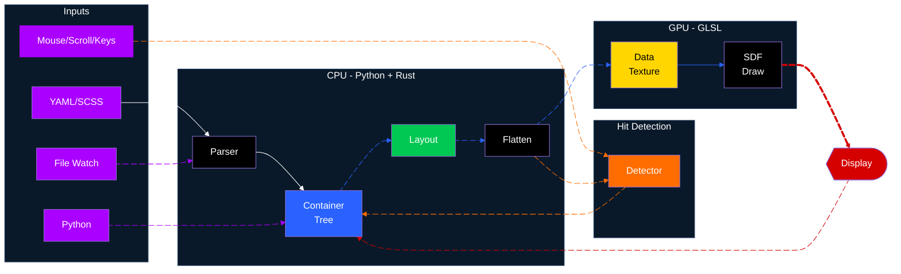

<div align="center">


<br>

*A declarative UI framework for Blender addons and much more*

<!--[](https://github.com/nicolaiprodromov/puree/actions/workflows/ci.yml) -->
[](https://github.com/nicolaiprodromov/puree/releases)
[](https://www.blender.org/)
[](https://github.com/nicolaiprodromov/puree/tree/master/puree/puree_core)

*Puree UI* is an open-source, pip-installable, GPU-accelerated UI framework for Blender extensions. It provides a web-inspired YAML/SCSS/Python stack for building modern, responsive interfaces — with built-in modules for networking, persistence, animation, markdown rendering, and native media playback (GIF, SVG, video, Lottie); addressing the limitations of Blender's native UI system.

> Puree is built with a **Rust** core, **Blender's native GPU module**, and the **Taffy** layout engine to deliver a high-performance, GPU-accelerated UI engine with a familiar web development paradigm.


</div>

---

## Why does Blender need a UI framework?

Blender's native UI excels at tool panels but wasn't designed for complex, stateful interfaces. Puree exists because:

### *GPU-Native Rendering*

Blender's `bpy.types.UILayout` is immediate-mode and limited to standard widgets — no custom shapes, gradients, animations, or free-form layout. Drawing anything richer means dropping down to the low-level [`gpu`](https://docs.blender.org/api/current/gpu.html) module and hand-writing shaders, batches, and event handling for every addon. Puree does that work once:

- The entire container tree renders in a single batched draw call through Blender's native `gpu` module. A signed-distance-field (SDF) fragment shader evaluates rounded corners, per-side borders, gradients, and box shadows per pixel.

- Per-container properties (position, color, radius, opacity, ...) are packed into a GPU data texture, so hundreds of containers render with no per-widget Python overhead.

- Because everything goes through Blender's own GPU abstraction, Puree is not tied to a specific graphics backend.

### *Why Abstraction Matters*

Like browsers evolving from DOM manipulation to high-level frameworks like React, Blender needs higher-level abstractions. Native `bpy.types.UILayout` handles tool panels, but complex UIs need state management and component patterns. Puree provides these abstractions with GPU acceleration. Focus on *what* your UI does, not *how* to draw it.

### *Design Patterns*

Puree replaces Blender's imperative `bpy.types.Panel` approach with declarative component trees using YAML/SCSS separation. Flexbox and grid layouts via **Taffy** (Rust) and native Rust hit detection enable real-time interactivity like hover states and smooth transitions.

### *Developer Ergonomics*

Imperative UI code couples structure with styling, changing a button's color means editing Python logic. Puree separates concerns architecturally: YAML defines component hierarchy, SCSS handles presentation via selectors. This mirrors the separation of HTML/CSS, enabling style changes without touching code and true component reusability across contexts.

---

## What is Puree good for?

*From addon user interfaces to complex object-based tracking in screen space, to interactive tutorials, to markdown rendering directly in Blender, to simple drawing anywhere in Blender, in real-time, using the gpu.*

Check the [tests](/tests) folder for a complete example of what can be accomplished with **Puree**.

<div align="center">

<video src="https://codeberg.org/nicolaiprodromov/puree/raw/branch/master/docs/images/example1.mp4" controls width="100%">
</video>


[*Example usage with hot reload for fast iterations*](https://youtu.be/moDWxOJ27fE?si=tnEKvIn6RMQNcraj)

<video src="https://codeberg.org/nicolaiprodromov/puree/raw/branch/master/docs/images/example2.mp4" controls width="100%">
</video>

[*Slightly more complex interface*](https://youtu.be/9Xn1MqDesqQ?si=nvzfTDF6uEu73VLC)

<video src="https://codeberg.org/nicolaiprodromov/puree/raw/branch/master/docs/images/example3.mp4" controls width="100%">
</video>

[*Scene object tracking example*](https://youtu.be/43_a7iXoEj4?si=DoZpDfxBQ6YlxP_u)

</div>

---

## Media: GIF · SVG · MP4 · Lottie

Puree plays media natively inside panels — animated GIFs and crisp vector SVGs ride the plain `img:` attribute, videos get HTML-style attributes plus a default controls bar, and Lottie/Bodymovin animations loop out of the box:

```yaml
spinner:  { style: spinner, img: loading.gif }     # animates automatically
logo:     { style: logo, img: brand.svg }          # crisp at any panel size
demo_video:
  style: demo_video
  video: intro.mp4
  controls: true          # play/seek/mute bar, auto-hides like a browser
  autoplay: true
  loop: true
  muted: true
celebration: { style: celebration, lottie: confetti.json }
```

Scripts drive playback through `container.media` (`play()`, `seek()`, `on("timeupdate", fn)`, …). GIF/SVG decode in the Rust core; the video (PyAV) and Lottie (rlottie) decoders ship bundled with Puree — `video:`/`lottie:` work out of the box, and a missing package still degrades gracefully. See [PUREE_SPEC.md — Media Elements](docs/PUREE_SPEC.md#10-media-elements).

Any container can also take over the whole panel region as a "theater mode" — `container.request_fullscreen()` / `exit_fullscreen()`, with `ESC` and the controls-bar button as exits. The default video controls expose it out of the box. See [PUREE_SPEC.md — Fullscreen](docs/PUREE_SPEC.md#fullscreen--region-presentation-mode).

---

## Quick Start
<!-- 
Here's a short tutorial to get you started with Puree:

<video src="https://codeberg.org/nicolaiprodromov/puree/raw/branch/master/docs/images/example4.mp4" controls width="50%">
</video> -->

> [!IMPORTANT]
> You'll need **Python 3.11+** for the CLI and **Blender 5.1+** available on your system PATH — the CLI drives Blender directly for scaffolding, building, and installing.

1. **Install Puree:**

    ```bash
    pip install puree-ui
    ```

2. **Create a new project:**

    ```bash
    mkdir my_addon && cd my_addon
    puree init
    ```

    This creates a complete project with all dependencies, a `blender_manifest.toml`, and a starter UI (a pink page with "PUREE" in blue text).

3. **Build the extension:**

    ```bash
    puree build
    ```

    The packaged extension zip lands in `dist/`.

4. **Install into Blender:**

    ```bash
    puree install
    ```

5. **Open Blender** - look for the Puree tab in the N-panel of the 3D Viewport.
6. **For faster development** (optional) - use symlink mode instead of build+install:

    ```bash
    puree link            # Symlink project into Blender (one-time)
    puree reload          # Reload after code changes
    puree unlink          # Remove symlink when done
    ```
---

## How it works

Puree follows a hybrid Rust/Python pipeline optimized for performance:

1. **Parse** - YAML defines the component tree; Rust compiles SCSS and resolves the CSS cascade into styled container trees
2. **Layout** - The Taffy flexbox/grid engine computes responsive layouts
3. **Flatten** - Rust optimizes the container hierarchy into GPU-ready buffers, sorted by z-index
4. **Render** - Blender's native GPU module draws all containers in a single batched pass with an SDF fragment shader
5. **Interact** - Rust hit detection handles all mouse, scroll, and keyboard events in real-time

<br>


```mermaid
flowchart LR
 subgraph INPUT["Inputs"]
        A["YAML/SCSS"]
        I["Mouse/Scroll/Keys"]
        K["Python"]
        M["File Watch"]
  end
 subgraph CPU["CPU - Python + Rust"]
        B["Parser"]
        C["Container<br>Tree"]
        D["Layout"]
        E["Flatten"]
  end
 subgraph HIT["Hit Detection"]
        J["Detector"]
  end
 subgraph GPU["GPU - GLSL"]
        G1["Data<br>Texture"]
        G2["SDF<br>Draw"]
  end
    A --> B
    B --> C
    K L_K_C_0@--> C
    C L_C_D_0@--> D
    D L_D_E_0@--> E
    E L_E_G1_0@--> G1
    G1 --> G2
    G2 L_G2_n1_0@==> n1["Display"]
    I L_I_J_0@--> J
    J L_J_C_0@--> C
    M L_M_B_0@-.-> B
    E L_E_J_0@-.-> J
    n1 L_n1_C_0@--> C

    n1@{ shape: display}
    style A fill:#AA00FF,color:#FFFFFF
    style I fill:#AA00FF,color:#FFFFFF,stroke:none
    style K fill:#AA00FF,color:#FFFFFF
    style M fill:#AA00FF,color:#FFFFFF
    style B fill:#000,color:#fff
    style C fill:#2962FF,color:#FFFFFF
    style D fill:#00C853,color:#FFFFFF
    style E fill:#000,color:#fff
    style J fill:#FF6D00,color:#fff
    style G1 fill:#FFD600,color:#000000
    style G2 fill:#000,color:#fff
    style n1 fill:#D50000,color:#FFFFFF
    style INPUT fill:#0a1929,stroke:#1e3a5f,color:#fff
    style CPU fill:#0a1929,stroke:#1e3a5f,color:#fff
    style HIT fill:#0a1929,stroke:#1e3a5f,color:#fff
    style GPU fill:#0a1929,stroke:#1e3a5f,color:#fff
    linkStyle 0 stroke:#FFFFFF,fill:none
    linkStyle 1 stroke:#FFFFFF,fill:none
    linkStyle 2 stroke:#AA00FF,fill:none
    linkStyle 3 stroke:#2962FF,fill:none
    linkStyle 4 stroke:#2962FF,fill:none
    linkStyle 5 stroke:#2962FF,fill:none
    linkStyle 6 stroke:#2962FF,fill:none
    linkStyle 7 stroke:#D50000,fill:none
    linkStyle 8 stroke:#FF6D00,fill:none
    linkStyle 9 stroke:#FF6D00,fill:none
    linkStyle 10 stroke:#AA00FF,fill:none
    linkStyle 11 stroke:#FF6D00,fill:none
    linkStyle 12 stroke:#D50000,fill:none

    L_K_C_0@{ animation: slow } 
    L_C_D_0@{ animation: slow } 
    L_D_E_0@{ animation: slow } 
    L_E_G1_0@{ animation: slow } 
    L_G2_n1_0@{ animation: fast } 
    L_I_J_0@{ animation: fast } 
    L_J_C_0@{ animation: fast } 
    L_M_B_0@{ animation: slow } 
    L_E_J_0@{ animation: fast } 
    L_n1_C_0@{ animation: slow } 


```

<br>

This architecture enables:

- **Native performance** - Critical paths run in compiled Rust code
- **GPU acceleration**   - The whole interface renders in a single batched SDF draw call
- **Backend agnostic**   - Rendering goes through Blender's own GPU module, not raw OpenGL
- **Reactive layouts**   - Automatic layout recompute on interactions, viewport resize, etc.


> Read the full [documentation](docs/DOCS.md) for detailed guides, API references, and examples.


---


## Roadmap

Puree aims to become the orchestration layer for user interfaces in Blender; prioritizing standardization, accessibility, and privacy while exposing deep creative freedom to developers.

<div align="center">


</div>

| Direction | Description |
|---|---|
| **Isolated Rust Runtime** | Standalone Rust runtime with narrow IPC surface. Container data flows from runtime to Blender; events flow back. Shared memory for rendered output. |
| **Accessibility** | Screen reader support, focus APIs, assistive technology. Semantic tree mapping containers to roles, labels, states, and focus order. WCAG contrast validation. |
| **Privacy & Permissions** | Extensions declare capabilities (filesystem paths, network hosts, Blender data). Runtime enforcement, user consent, and action logging. |
| **Reference Extensions** | Port the [Lottie renderer](https://superhivemarket.com/products/lottie-addon) and [SVG exporter](https://superhivemarket.com/products/svg-exporter) to Puree as open-source reference implementations. |

---


### Getting Help

For questions and support, check out the [docs](docs/DOCS.md) or [support guide](docs/SUPPORT.md).

---


> *Special thanks to the open-source community and the developers behind the projects that make **Puree** possible.*

