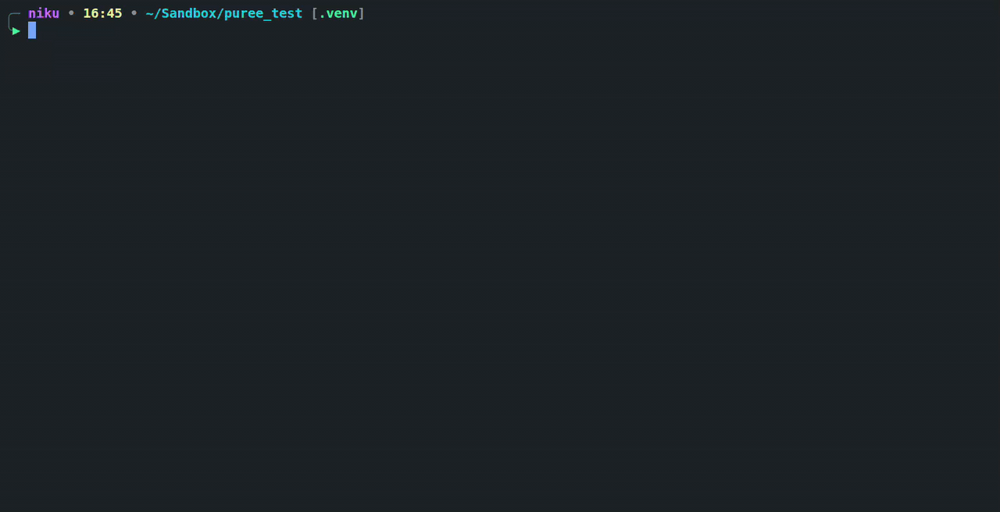

<div align="center">


<br>

*A declarative UI framework for Blender addons and much more*

[](https://github.com/nicolaiprodromov/puree/actions/workflows/ci.yml)
[](https://github.com/nicolaiprodromov/puree/releases)
[](https://www.blender.org/)
[](https://github.com/moderngl/moderngl)

*Puree UI* for Blender is a declarative framework that provides a web-inspired API for building user interfaces, addressing the limitations of Blender's native UI system in supporting complex interface architectures and providing enhanced flexibility.

It's meant for all Blender users that want to enhance their ability to present their creations, models, addons and products inside the software in a streamlined, easy & intuitive way, adaptable to causal users and powerful enough for seasoned programmers.

> Puree is built with a **Rust** backend, **ModernGL**, and **Stretchable** to deliver a high-performance, GPU-accelerated UI engine with a familiar web development paradigm.



</div>

---

## Why does Blender need a UI framework?

Blender's native UI excels at tool panels but wasn't designed for complex, stateful interfaces. Puree exists because:

### *GPU API Constraints*

Blender's `gpu` module provides Python bindings for GPU rendering, but with architectural limitations that constrain certain rendering approaches.

- The [`gpu.types.GPUShader`](https://docs.blender.org/api/current/gpu.types.html#gpu.types.GPUShader) API enforces vertex + fragment shader pairs for traditional geometry rendering. This works for drawing meshes but requires additional overhead for UI operations like filling thousands of rectangles per frame.

- While Blender's Python API exposes [compute shader support](https://docs.blender.org/api/current/gpu.html#custom-compute-shader-using-image-store-and-vertex-fragment-shader), it currently targets image-based operations using `imageStore()`. Direct binding of Shader Storage Buffer Objects (SSBOs) for custom data-parallel algorithms is not available through the Python API—this technique is needed for efficient UI rendering where container properties (position, color, border radius) must be processed in parallel.

### *Why Abstraction Matters*

Like browsers evolving from DOM manipulation to high-level frameworks like React, Blender needs higher-level abstractions. Native `bpy.types.UILayout` handles tool panels, but complex UIs need state management and component patterns. Puree provides these abstractions with GPU acceleration. Focus on *what* your UI does, not *how* to draw it.

### *Design Patterns*

Puree replaces Blender's imperative `bpy.types.Panel` approach with declarative component trees using YAML/SCSS separation. Flexbox layouts via **Stretchable** (Rust) and GPU-accelerated hit detection enable real-time interactivity like hover states and smooth transitions.

### *Developer Ergonomics*

Imperative UI code couples structure with styling, changing a button's color means editing Python logic. Puree separates concerns architecturally: YAML defines component hierarchy, SCSS handles presentation via selectors. This mirrors the separation of HTML/CSS, enabling style changes without touching code and true component reusability across contexts.

---

## What is Puree good for?

*From addon user interfaces to complex object-based tracking in screen space, to interactive tutorials, to markdown rendering directly in Blender, to simple drawing anywhere in Blender, in real-time, using the gpu.*

Check the [examples](/examples) folder for detailed examples of what can be accomplished with **Puree**.

<div align="center">

<video src="docs/images/example1.mp4" controls width="100%">
</video>

[*Example usage with hot reload for fast iterations*](https://youtu.be/moDWxOJ27fE?si=tnEKvIn6RMQNcraj)

<video src="docs/images/example2.mp4" controls width="100%">
</video>

[*Slightly more complex interface*](https://youtu.be/9Xn1MqDesqQ?si=nvzfTDF6uEu73VLC)

<video src="docs/images/example3.mp4" controls width="100%">
</video>

[*Scene object tracking example*](https://youtu.be/43_a7iXoEj4?si=DoZpDfxBQ6YlxP_u)

</div>

---

## Quick Start

Here's a short tutorial to get you started with Puree:

<video src="docs/images/example4.mp4" controls width="50%">
</video>

> [!IMPORTANT]
> ### **Puree is in beta - WIP**
> - Puree currently works **only** with Blender's OpenGL backend because of the ModernGL dependency.

1. **Install Puree:**

    ```bash
    pip install puree-ui
    ```

2. **Create a new project:**

    ```bash
    mkdir my_addon && cd my_addon
    puree init
    ```

    This creates a complete project with all dependencies, a `blender_manifest.toml`, and a starter UI (pink box with "PUREE" in bold blue text).

3. **Build the extension:**

    ```bash
    puree build
    ```

    Requires Blender on your system PATH.

4. **Install into Blender:**

    ```bash
    puree install
    ```

5. **Open Blender** — look for the Puree tab in the N-panel of the 3D Viewport.
6. **For faster development** (optional) — use symlink mode instead of build+install:

    ```bash
    puree link            # Symlink project into Blender (one-time)
    puree reload          # Reload after code changes
    puree unlink          # Remove symlink when done
    ```
---

## How it works

Puree follows a hybrid Rust/Python pipeline optimized for performance:

1. **Parse** – Rust-native parsers process YAML/SCSS into styled container trees
2. **Layout** – Stretchable flexbox engine computes responsive layouts  
3. **Flatten** – Rust optimizes container hierarchy into GPU-ready buffers
4. **Render** – ModernGL compute shaders generate UI texture with full effects
5. **Interact** – Rust hit detection handles all mouse/scroll events in real-time

<br>


```mermaid
flowchart LR
 subgraph INPUT["Inputs"]
        A["YAML/SCSS"]
        I["Mouse/Scroll"]
        K["Python"]
        M["File Watch"]
  end
 subgraph CPU["CPU - Rust"]
        B["Parser"]
        C["Container<br>Tree"]
        D["Layout"]
        E["Flatten"]
  end
 subgraph HIT["Hit Detection"]
        J["Detector"]
  end
 subgraph GPU["GPU - GLSL"]
        G1["Compute"]
        G2["SDF"]
        G3["Composite"]
  end
    A --> B
    B --> C
    K L_K_C_0@--> C
    C L_C_D_0@--> D
    D L_D_E_0@--> E
    E L_E_G1_0@--> G1
    G1 --> G2
    G2 --> G3
    G3 L_G3_H_0@--> H["Texture"]
    H L_H_n1_0@==> n1["Display"]
    I L_I_J_0@--> J
    J L_J_C_0@--> C
    M L_M_B_0@-.-> B
    H L_H_J_0@-.-> J
    n1 L_n1_C_0@--> C

    n1@{ shape: display}
    style A fill:#AA00FF,color:#FFFFFF
    style I fill:#AA00FF,color:#FFFFFF,stroke:none
    style K fill:#AA00FF,color:#FFFFFF
    style M fill:#AA00FF,color:#FFFFFF
    style B fill:#000,color:#fff
    style C fill:#2962FF,color:#FFFFFF
    style D fill:#00C853,color:#FFFFFF
    style E fill:#000,color:#fff
    style J fill:#FF6D00,color:#fff
    style G1 fill:#000,color:#fff
    style G2 fill:#000,color:#fff
    style G3 fill:#000,color:#fff
    style H fill:#FFD600,color:#000000
    style n1 fill:#D50000,color:#FFFFFF
    style INPUT fill:#0a1929,stroke:#1e3a5f,color:#fff
    style CPU fill:#0a1929,stroke:#1e3a5f,color:#fff
    style HIT fill:#0a1929,stroke:#1e3a5f,color:#fff
    style GPU fill:#0a1929,stroke:#1e3a5f,color:#fff
    linkStyle 0 stroke:#FFFFFF,fill:none
    linkStyle 1 stroke:#FFFFFF,fill:none
    linkStyle 2 stroke:#AA00FF,fill:none
    linkStyle 3 stroke:#2962FF,fill:none
    linkStyle 4 stroke:#2962FF,fill:none
    linkStyle 5 stroke:#2962FF,fill:none
    linkStyle 6 stroke:#2962FF,fill:none
    linkStyle 7 stroke:#2962FF,fill:none
    linkStyle 8 stroke:#2962FF,fill:none
    linkStyle 9 stroke:#D50000,fill:none
    linkStyle 10 stroke:#FF6D00,fill:none
    linkStyle 11 stroke:#FF6D00,fill:none
    linkStyle 12 stroke:#AA00FF,fill:none
    linkStyle 13 stroke:#FF6D00,fill:none
    linkStyle 14 stroke:#D50000,fill:none

    L_K_C_0@{ animation: slow } 
    L_C_D_0@{ animation: slow } 
    L_D_E_0@{ animation: slow } 
    L_E_G1_0@{ animation: slow } 
    L_G3_H_0@{ animation: fast } 
    L_H_n1_0@{ animation: fast } 
    L_I_J_0@{ animation: fast } 
    L_J_C_0@{ animation: fast } 
    L_M_B_0@{ animation: slow } 
    L_H_J_0@{ animation: fast } 
    L_n1_C_0@{ animation: slow } 


```

<br>

This architecture enables:

- **Native performance** – Critical paths run in compiled Rust code
- **GPU acceleration**   – All rendering & parallel computation happens in shaders
- **Reactive layouts**   – Automatic layout recompute on interactions, viewport resize, etc.


> Read the full [documentation](docs/DOCS.md) for detailed guides, API references, and examples.

## Support & Issues

### Getting Help

For questions and support, check out the [docs](docs/DOCS.md) or [support guide](docs/SUPPORT.md).

### Reporting Issues

Found a bug or have a feature request? [Open an issue](https://github.com/nicolaiprodromov/puree/issues) with:

- Clear description of the problem or feature
- Steps to reproduce (for bugs)
- Blender version and OS
- Relevant error messages or screenshots

## Built With

<a href="https://www.blender.org/"></a> <a href="https://www.python.org/"></a> <a href="https://www.rust-lang.org/"></a> <a href="https://www.khronos.org/opengl/wiki/OpenGL_Shading_Language"></a> <a href="https://pyo3.rs/"></a> <a href="https://github.com/moderngl/moderngl"></a> <a href="https://github.com/vislyhq/stretchable"></a>

> *Special thanks to the open-source community and the developers behind the projects that make **Puree** possible.*


