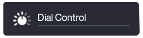

> [!NOTE]
> Check out the [README](https://github.com/nicolaiprodromov/puree/blob/master/README.md) for a quick start guide.
>
> Read [full documentation](https://nicolaiprodromov.github.io/puree/) for detailed usage guides.
>
> Read the [`components`](https://nicolaiprodromov.github.io/puree/COMPONENTS.html/) page for details on how components work and how to use them.

## Components

### Overview

1. [XWZ Pack I](#base-ui-elements)

---

### Base UI Elements

All free puree XWZ resources will be listed here:


<blockquote>
<a href="">
    
</a><a href="">
    
</a>

<a href="https://github.com/nicolaiprodromov/puree/releases">
    
</a> 
</blockquote>

<blockquote>
<a href="">
    
</a><a href="">
    
</a>

<a href="https://github.com/nicolaiprodromov/puree/releases">
    
</a> 
</blockquote>

1. **Simple Label**
    
    

    ```yaml
    simple_label:
        data           : '[icon_label]'
        il_icon_img    : 'dial'
        il_text_value  : 'Dial Control'
        il_font_value  : 'NeueMontreal-Regular'
        bg_color       : '#252830'
        padding_value  : '15px 20px'
        icon_size      : '50px'
        text_scale     : '20px'
        text_color     : '#f5f8fa'
        underline_color: 'rgba(140, 150, 165, 0.5)'
    ``` 